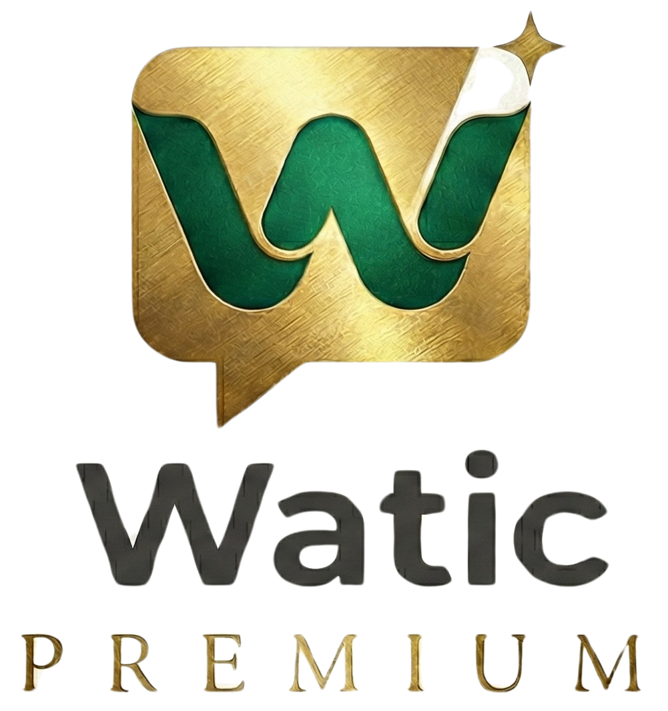

  

# 🌐 Watink: Open Source Distributed WhatsApp Platform

**Watink** é uma plataforma de atendimento omnicanal **Open Source**, distribuída e altamente escalável. Projetada nativamente para **Docker Swarm**, ela permite que empresas de qualquer porte orquestrem milhares de conversas simultâneas com estabilidade, automação e inteligência.

> *Do desenvolvedor para a comunidade. Livre, robusto e pronto para produção.*

---

## 🚀 Por que Watink?

Diferente de soluções monolíticas tradicionais, o Watink foi construído sobre uma **Arquitetura Orientada a Eventos**. Isso significa que cada componente – do motor de conexão WhatsApp ao construtor de fluxos – escala independentemente, garantindo que sua operação nunca pare.

### Destaques do Ecossistema

*   **🔓 100% Open Source**: Código transparente, sem lock-in. A comunidade constrói junto.
*   **🐳 Native Swarm**: Deploy on-premise ou cloud com orquestração de containers profissional.
*   **🔌 Drivers Modulares**: Suporte a múltiplos motores de conexão (Whaileys/WhatsMeow) via microserviços.
*   **🧠 IA Integrada (RAG)**: Chatbots que leem seus documentos PDF/Web e respondem humanamente usando Vector Database (pgvector).

---

## 💥 Funcionalidades Poderosas

O Watink não é apenas um "disparador". É um sistema operacional completo para atendimento ao cliente.

### 🎨 Flow Builder Visual
Crie automações complexas arrastando e soltando blocos.
*   **No-Code**: Construa menus, capture dados e tome decisões.
*   **Integração Total**: Dispare Webhooks ou mova cards no Kanban diretamente do fluxo.

### 📊 CRM & Pipeline Kanban
Transforme conversas em vendas organizadas.
*   **Gestão Visual**: Mova leads entre etapas (Prospecção -> Negociação -> Fechamento).
*   **Automação**: O fluxo pode qualificar e mover o lead automaticamente.

### 🏢 Gestão de Filas e Departamentos
Organize sua operação de atendimento.
*   **Filas Avançadas**: Distribuição de carga Round-Robin ou balanceada entre agentes.

### 📈 Campanhas Inteligentes
Marketing de alto impacto.
*   **Segmentação por Tags**: Envie a mensagem certa para o público certo.
*   **Agendamento Preciso**: Prepare campanhas para datas especiais.

---

## 🏗️ Engenharia Distribuída

Nossa stack é escolhida para performance e confiabilidade:

| Camada | Tecnologia | Função |
| :--- | :--- | :--- |
| **Frontend** | React + Vite + MUI | Interface SPA reativa e leve. |
| **Backend** | Node.js + Express | API Gateway e Regras de Negócio. |
| **Messaging** | **RabbitMQ** | Backbone de eventos para garantir entrega de mensagens. |
| **Database** | PostgreSQL + **PostGIS** | Dados relacionais e geográficos. |
| **Vector DB** | **pgvector** | Busca semântica para Inteligência Artificial. |

| **Engine** | Microserviços Isolados | Workers dedicados para cada conexão WhatsApp. |

---

## � Documentação

Acreditamos que um bom software precisa de uma ótima documentação.

### 👤 Para Usuários e Gestores
Acesse o **Manual Completo do Usuário (User Guide)** para aprender a operar a plataforma:
*   [🚀 Primeiros Passos e Conexão](userguide/connections/CONNECTING.md)
*   [💬 Gestão de Atendimentos](userguide/chats/USING_CHATS.md)
*   [⚙️ Criando Fluxos no Flow Builder](userguide/flowbuilder/CREATING_FLOWS.md)
*   [📚 Ver Manual Completo](userguide/README.md)

### � Para Desenvolvedores
Quer contribuir ou customizar? Mergulhe na nossa **Documentação Técnica**:
*   [🛠️ Guia de Contribuição e Regras](rule/dev.md)
*   [🏗️ Arquitetura de Microserviços](docs/microservices/ARCHITECTURE.md)
*   [🔌 API Reference (Swagger)](docs/backend/API.md)

---

## 🤝 Contribua

O Watink é mantido pela comunidade. PRs são bem-vindos!
1.  Faça um Fork do projeto.
2.  Crie sua Feature Branch (`git checkout -b feature/AmazingFeature`).
3.  Commit suas mudanças (`git commit -m 'Add some AmazingFeature'`).
4.  Push para a Branch (`git push origin feature/AmazingFeature`).
5.  Abra um Pull Request.

---

  Construído com 🤖 pela equipe Watink. Do Ceará para o mundo!

