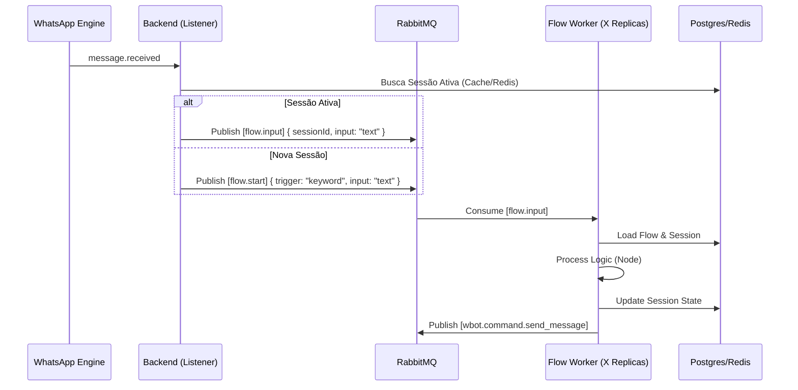

# 📈 Estratégia de Escalabilidade: Flow Engine Microservice

## 1. Diagnóstico Atual

Atualmente, o **Flow Engine** roda acoplado ao **Backend Monolítico** (`backend`).
O `wbotMessageListener` intercepta mensagens e chama `FlowExecutorService` diretamente (síncrono/in-process).

### ⚠️ Gargalos em Escala
1.  **Bloqueio de Event Loop**: Processar lógica complexa de fluxo (Regex, JSON parsing, Condicionais) dentro do listener de mensagens pode atrasar o processamento de mensagens simples.
2.  **Concorrência de Recursos**: O Backend divide CPU/RAM entre servir a API HTTP (Dashboard) e processar a lógica de automação.
3.  **Ponto Único de Falha**: Se um fluxo mal formado travar o processo (ex: loop infinito ou estouro de memória), derruba a API inteira.

---

## 2. Estratégia Proposta: Arquitetura Orientada a Eventos (Event-Driven)

Para escalar, devemos desacoplar a **Detecção do Evento** da **Execução do Fluxo**, utilizando o RabbitMQ como buffer.

### 🏗️ Nova Topologia

1.  **Producer (Backend/Listener)**:
    *   Ao receber mensagem, apenas verifica se deve disparar fluxo.
    *   Se sim, publica mensagem na fila: `flow.execution.process`.
    *   *Tempo de resposta imediato.*

2.  **Queue (RabbitMQ)**:
    *   Fila: `flow.execution.process`
    *   Garante persistência e ordem de processamento.
    *   Permite "Backpressure" (se o sistema estiver sobrecarregado, as mensagens acumulam na fila sem derrubar o servidor).

3.  **Consumer (Novo Microserviço: `flow-engine-worker`)**:
    *   Serviço Node.js leve, sem servidor HTTP (apenas worker).
    *   Escala horizontalmente (pode ter 10 replicas consumindo a mesma fila).
    *   Responsabilidade: Carregar Sessão -> Executar Nó -> Salvar Estado -> Enviar Comando.

---

## 3. Implementação Técnica

### A. Fluxo de Dados Otimizado

### B. Otimização de Estado (Redis)

Para evitar hits excessivos no PostgreSQL a cada mensagem:
1.  **Cache de Sessão**: Manter `active_sessions:{ticketId}` no Redis.
2.  **TTL**: Sessões expiram do cache após 30min de inatividade (persistidas no Postgres).
3.  **Lock Distribuído**: Garantir que duas mensagens simultâneas do mesmo usuário não sejam processadas em paralelo pelo mesmo fluxo (race condition).

---

## 4. Roadmap de Migração

### Fase 1: Preparação (Atual)
- [x] Implementar `FlowExecutorService` modular.
- [ ] Criar filas `flow.*` no RabbitMQService.

### Fase 2: Desacoplamento Lógico
- [ ] Alterar `wbotMessageListener` para não chamar `Service` direto, mas sim publicar no RabbitMQ (mesmo que o consumidor seja o próprio Backend por enquanto).

### Fase 3: Extração Física
- [ ] Criar container `flow-engine-worker` (Docker).
- [ ] Mover lógica de `FlowExecutor` para este novo serviço.
- [ ] Configurar Auto-scaling no Docker Swarm para este serviço baseado no tamanho da fila RabbitMQ.

---

## 5. Conclusão

Esta estratégia alinha o Flow Engine com a arquitetura de microserviços do projeto (`dev_micro.md`), garantindo que o crescimento no volume de automações não impacte a performance da API ou do atendimento humano.
