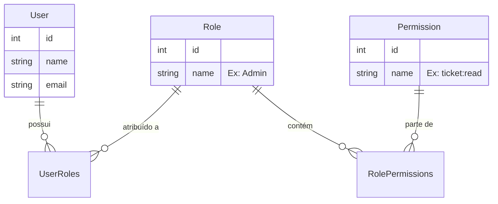

# Documentação do Sistema RBAC (Role-Based Access Control) Enterprise

Este documento descreve a lógica, arquitetura e fluxo de funcionamento do novo sistema de controle de acesso (RBAC) implementado no backend do Watink.

## 1. Visão Geral

O objetivo do RBAC Enterprise é substituir o sistema legado de permissões baseadas em "flags" diretas (UserPermission/GroupPermission) por um sistema robusto baseado em **Papéis (Roles)**. Isso permite uma gestão mais escalável e flexível, onde permissões são atribuídas a papéis, e papéis são atribuídos a usuários.

## 2. Arquitetura do Banco de Dados

O sistema foi reestruturado em torno de 4 tabelas principais, eliminando as antigas `UserPermissions` e `GroupPermissions`.

### Novas Entidades

1.  **Roles (`Roles`)**:
    *   Define um conjunto de responsabilidades (ex: `Admin`, `User`, `Supervisor`).
    *   Campos: `id`, `name`, `description`, `tenantId`.

2.  **Permissions (`Permissions`)**:
    *   Define a unidade atômica de acesso.
    *   Formato padronizado: `resource:action` (ex: `ticket:read`, `contact:write`, `dashboard:view`).
    *   Campos: `id`, `name` (slug), `description`.

3.  **RolePermissions (`RolePermissions`)**:
    *   Tabela associativa (Many-to-Many) entre Roles e Permissions.
    *   Define o que cada papel pode fazer.

4.  **UserRoles (`UserRoles`)**:
    *   Tabela associativa (Many-to-Many) entre Users e Roles.
    *   Define quais papéis um usuário possui dentro de um Tenant.

### Diagrama de Relacionamento



## 3. Lógica de Funcionamento

### A. Atribuição de Permissões
Diferente do modelo anterior onde a permissão era booleana e direta no usuário, agora o fluxo é:
1.  O Administrador cria um **Role** (ex: "Atendente Nível 1").
2.  O Administrador seleciona as **Permissions** que esse Role deve ter.
3.  O Administrador associa o **Role** ao **User**.

### B. Verificação de Acesso (Middleware)
A verificação ocorre em tempo real nas rotas protegidas. O middleware `checkPermission`:
1.  Intercepta a requisição.
2.  Identifica o usuário logado (`req.user.id`).
3.  Consulta todas as Roles do usuário.
4.  Coleta todas as Permissões associadas a essas Roles.
5.  Verifica se a permissão necessária (ex: `contact:delete`) está presente na lista.

**Exemplo de Uso na Rota:**
```typescript
ticketRoutes.delete(
  "/tickets/:ticketId",
  isAuth,
  checkPermission("ticket:delete"), // Exige essa permissão específica
  TicketController.remove
);
```

### C. Super Usuários
Usuários com a flag `isSuper` (Admin do Sistema) ou com o perfil `Admin` do Tenant geralmente bypassam verificações restritivas ou possuem todas as permissões atribuídas via seed inicial.

## 4. Migração e Compatibilidade

### O que foi removido?
*   Tabela `UserPermissions`.
*   Tabela `GroupPermissions`.
*   Serviços legados que populavam essas tabelas.

### O que mudou nos Serviços?
Serviços de listagem (`ListTicketsService`, `ListContactsService`) foram refatorados para não dependerem de `joins` com as tabelas removidas.
*   **Correção de Erros SQL**: Onde antes se fazia um `include: [UserPermission]`, agora a validação é feita previamente ou via `UserRoles`, evitando erros de "missing FROM-clause" em queries complexas do Sequelize.

## 5. Manutenção e Seeds

*   **Seeds**: O arquivo de seed inicial agora cria automaticamente as permissions básicas e os roles `Admin` e `User` para novos ambientes.
*   **Update**: O script `./update.sh backend` é responsável por rodar as migrações que criam essa estrutura e garantem a integridade dos dados.
