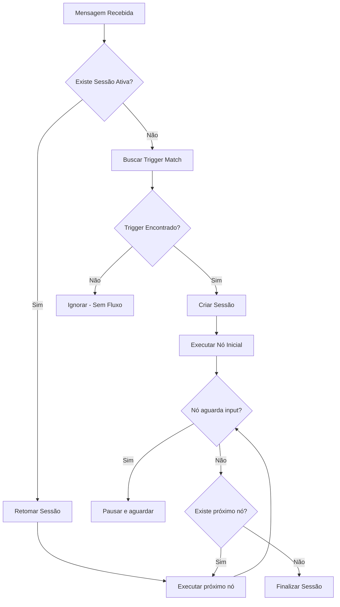

# 🤖 Flow Assistant - Base de Conhecimento Completa

Este documento fornece uma análise profunda e completa do **FlowBuilder** do whaticket Premium, permitindo que o Flow Assistant compreenda todos os nós, suas configurações, comportamentos e boas práticas para criação de fluxos eficientes.

---

## 📋 Índice

1. [Visão Geral da Arquitetura](#visão-geral-da-arquitetura)
2. [Catálogo Completo de Nós](#catálogo-completo-de-nós)
3. [Sistema de Execução](#sistema-de-execução)
4. [Variáveis e Contexto](#variáveis-e-contexto)
5. [Boas Práticas na Criação de Fluxos](#boas-práticas-na-criação-de-fluxos)
6. [Exemplos de Fluxos](#exemplos-de-fluxos)
7. [Limitações e Considerações](#limitações-e-considerações)

---

## 🏗️ Visão Geral da Arquitetura

O FlowBuilder é um sistema visual baseado em **React Flow** que permite criar automações de conversação para WhatsApp. A arquitetura é dividida em:

### Frontend (React)
- **Componentes de Nó**: Visualização e edição de cada tipo de nó
- **NodesSidebar**: Paleta de nós disponíveis para arrastar
- **NodeEditorSidebar**: Formulário de configuração de cada nó
- **FlowChat**: Interface de chat com IA para geração de fluxos

### Backend (Node.js + TypeScript)
- **FlowExecutorService**: Motor de execução de fluxos
- **FlowTriggerService**: Gerenciamento de gatilhos
- **FlowAIService**: Geração de fluxos via IA (OpenAI/Grok)
- **FlowWorkerService**: Processamento assíncrono

### Modelos de Dados
- **Flow**: Definição do fluxo (nodes, edges, configurações)
- **FlowSession**: Estado de execução de um usuário no fluxo
- **FlowTrigger**: Mapeamento de eventos para fluxos

---

## 📦 Catálogo Completo de Nós

### 🟢 CATEGORIA: WhatsApp

#### 1. **Gatilho (Trigger Node)**
**Tipo no sistema**: `trigger`  
**Cor**: Verde (#4caf50)  
**Ícone**: Notifications

**Descrição**: Ponto de entrada do fluxo baseado em condições de mensagem.

**Configurações disponíveis**:
| Campo | Tipo | Opções | Descrição |
|-------|------|--------|-----------|
| `triggerType` | select | `keyword`, `any`, `firstContact` | Tipo de gatilho |
| `conditions` | array | - | Condições de ativação (quando tipo = keyword) |

**Condições de Ativação** (ConditionBuilder):
- **Campo**: `lastInput`, `contactName`, `contactNumber`, etc.
- **Operador**: `equals`, `contains`, `startsWith`, `endsWith`, `isEmpty`, etc.
- **Valor**: Texto ou variável

**Exemplo de uso**: Iniciar fluxo quando mensagem contém "promoção"

---

#### 2. **Mensagem (Message Node)**
**Tipo no sistema**: `message`  
**Cor**: Azul (#2196f3)  
**Ícone**: Message

**Descrição**: Envia uma mensagem de texto ou mídia para o contato.

**Configurações disponíveis**:
| Campo | Tipo | Opções | Descrição |
|-------|------|--------|-----------|
| `contentType` | select | `text`, `image`, `video`, `audio`, `file` | Tipo de conteúdo |
| `content` | textarea | - | Texto da mensagem (quando tipo = text) |
| `mediaUrl` | text | - | URL do arquivo (quando tipo != text) |

**Variáveis disponíveis para interpolação**:
- `{{firstName}}` - Primeiro nome do contato
- `{{name}}` - Nome completo do contato
- `{{protocol}}` - Número do protocolo/ticket
- `{{date}}` - Data atual

**Comportamento**: Após enviar a mensagem, segue automaticamente para o próximo nó (não aguarda resposta).

---

#### 3. **Menu (Menu Node)**
**Tipo no sistema**: `menu`  
**Cor**: Laranja (#ff9800)  
**Ícone**: List

**Descrição**: Exibe um menu interativo com opções para o usuário escolher.

**Configurações disponíveis**:
| Campo | Tipo | Descrição |
|-------|------|-----------|
| `menuTitle` | text | Título/pergunta do menu |
| `options` | array | Lista de opções `[{id, label}]` |

**Comportamento de renderização**:
- **≤ 3 opções**: Renderiza como **botões** (quick_reply)
- **> 3 opções**: Renderiza como **lista** (single_select)

**Comportamento de navegação**:
- Cada opção pode ter uma conexão de saída própria (handle por ID)
- O fluxo **PAUSA** e aguarda a resposta do usuário
- Matching é feito por: texto exato, ID da opção, ou número (1, 2, 3...)

**Badge**: Exibe quantidade de opções no canto do nó

---

### 🟣 CATEGORIA: Lógica

#### 4. **Início (Start/Input Node)**
**Tipo no sistema**: `input` ou `start`  
**Cor**: Verde (#4caf50)  
**Ícone**: PlayArrow

**Descrição**: Ponto de entrada obrigatório do fluxo.

**Configurações disponíveis**:
| Campo | Tipo | Opções | Descrição |
|-------|------|--------|-----------|
| `triggerType` | select | `time`, `action`, `message` | Tipo de gatilho do início |
| `actionType` | select | `ticketCreated`, `ticketClosed`, `contactCreated`, `queueChanged` | Tipo de ação (quando triggerType = action) |
| `whatsappId` | select | - | Conexão específica (quando triggerType = message) |

**Handles**: 
- Entrada: ❌ Nenhuma
- Saída: ✅ Uma (direita)

---

#### 5. **Decisão (Switch Node)**
**Tipo no sistema**: `switch`  
**Cor**: Roxo (#9c27b0)  
**Ícone**: CallSplit

**Descrição**: Bifurcação condicional do fluxo baseada em regras.

**Configurações disponíveis**:
| Campo | Tipo | Descrição |
|-------|------|-----------|
| `conditionsA` | array | Condições para seguir caminho A (verde) |

**Handles de saída**:
- **Handle `a`** (verde ✓): Quando condições são verdadeiras
- **Handle `b`** (vermelho ✗): Quando condições são falsas (else)

**Campos disponíveis para condição**:
- `lastInput` - Última mensagem do usuário
- `contactName` - Nome do contato
- `contactNumber` - Número do contato
- `ticketStatus` - Status do ticket
- `queueName` - Nome da fila
- `tagName` - Tag associada
- `dayOfWeek` - Dia da semana (0-6)
- `currentHour` - Hora atual (0-23)

**Operadores**:
| Operador | Descrição |
|----------|-----------|
| `equals` | Igual a |
| `notEquals` | Diferente de |
| `contains` | Contém |
| `notContains` | Não contém |
| `startsWith` | Começa com |
| `endsWith` | Termina com |
| `isEmpty` | Está vazio |
| `isNotEmpty` | Não está vazio |
| `greaterThan` | Maior que (numérico) |
| `lessThan` | Menor que (numérico) |

---

#### 6. **Fim (End/Output Node)**
**Tipo no sistema**: `output` ou `end`  
**Cor**: Vermelho (#f44336)  
**Ícone**: Stop

**Descrição**: Finaliza a execução do fluxo.

**Configurações disponíveis**:
| Campo | Tipo | Opções | Descrição |
|-------|------|--------|-----------|
| `endAction` | select | `none`, `closeTicket`, `transferQueue`, `sendMessage` | Ação ao finalizar |
| `endMessage` | textarea | - | Mensagem de encerramento (quando endAction = sendMessage) |

**Handles**:
- Entrada: ✅ Uma (esquerda)
- Saída: ❌ Nenhuma

---

### 🔵 CATEGORIA: Utilitários

#### 7. **Pipeline (Kanban/CRM Node)**
**Tipo no sistema**: `pipeline`  
**Cor**: Ciano (#00bcd4)  
**Ícone**: Timeline

**Descrição**: Integração com o sistema de Kanban/CRM para gerenciar oportunidades.

**Configurações disponíveis**:
| Campo | Tipo | Opções | Descrição |
|-------|------|--------|-----------|
| `kanbanAction` | select | `createDeal`, `moveDeal` | Ação a executar |
| `pipelineId` | select | - | Pipeline de destino |
| `stageId` | select | - | Etapa/coluna do pipeline |
| `dealTitle` | text | - | Título da oportunidade (createDeal) |
| `dealValue` | text | - | Valor monetário (createDeal) |
| `dealPriority` | select | `1`, `2`, `3` | Prioridade: Baixa, Média, Alta |

**Variáveis**: Campos aceitam variáveis como `{{contactName}}`

---

#### 8. **Conhecimento/IA (Knowledge Node)**
**Tipo no sistema**: `knowledge`  
**Cor**: Rosa (#e91e63)  
**Ícone**: EmojiObjects

**Descrição**: Consulta base de conhecimento e/ou gera resposta via IA.

**Configurações disponíveis**:
| Campo | Tipo | Opções | Descrição |
|-------|------|--------|-----------|
| `responseMode` | select | `auto`, `suggest`, `search` | Modo de resposta |
| `knowledgeBaseId` | select | - | Base de conhecimento a consultar |

**Modos de resposta**:
- **auto**: Responde automaticamente ao usuário
- **suggest**: Sugere resposta para o atendente
- **search**: Apenas busca, não responde

---

#### 9. **Database Node**
**Tipo no sistema**: `database`  
**Cor**: Marrom (#795548)  
**Ícone**: Storage

**Descrição**: Operações de leitura/atualização no banco de dados.

**Configurações disponíveis**:
| Campo | Tipo | Opções | Descrição |
|-------|------|--------|-----------|
| `operation` | select | `read`, `update` | Operação a executar |
| `tableName` | select | Ver lista abaixo | Tabela de destino |
| `filters` | array | - | Filtros NOCODE |
| `selectedFields` | array | - | Campos a retornar (READ) |
| `dataFields` | array | - | Campos a atualizar (UPDATE) |
| `limit` | select | `1`, `5`, `10`, `25`, `50` | Limite de registros |
| `orderByField` | select | - | Campo para ordenação |
| `orderByDir` | select | `ASC`, `DESC` | Direção da ordenação |
| `outputVariable` | text | - | Nome da variável de saída |

**Tabelas disponíveis**:
| Tabela | Campos disponíveis |
|--------|-------------------|
| `Contacts` | id, name, number, email, isGroup, profilePicUrl, createdAt |
| `Tickets` | id, status, queueId, userId, contactId, isGroup, createdAt, updatedAt |
| `Messages` | id, body, fromMe, mediaType, ticketId, createdAt |
| `Users` | id, name, email, profile, createdAt |
| `Queues` | id, name, color, createdAt |
| `Whatsapps` | id, name, status, isDefault, createdAt |
| `QuickAnswers` | id, shortcut, message, createdAt |
| `Pipelines` | id, name, createdAt |

**Operadores de filtro**:
| Operador | SQL Equivalente |
|----------|-----------------|
| `=` | WHERE field = value |
| `!=` | WHERE field != value |
| `>` | WHERE field > value |
| `<` | WHERE field < value |
| `>=` | WHERE field >= value |
| `<=` | WHERE field <= value |
| `like` | WHERE field LIKE %value% |

---

#### 10. **Filtro de Dados (Filter Node)**
**Tipo no sistema**: `filter`  
**Cor**: Violeta (#7c3aed)  
**Ícone**: FilterList

**Descrição**: Filtra dados de uma variável do contexto.

**Configurações disponíveis**:
| Campo | Tipo | Descrição |
|-------|------|-----------|
| `inputVariable` | text | Variável contendo os dados a filtrar |
| `filterConditions` | array | Condições de filtro |
| `outputVariable` | text | Variável para armazenar resultado filtrado |

**Campos filtráveis**: id, name, status, email, number, body, queueId, userId, createdAt

**Uso típico**: Após um Database READ, use o Filter para refinar os resultados.

---

#### 11. **Ticket Node**
**Tipo no sistema**: `ticket`  
**Cor**: Rosa/Magenta (#f06292)  
**Ícone**: ConfirmationNumber

**Descrição**: Manipula o ticket atual (status, fila, atendente).

**Configurações disponíveis**:
| Campo | Tipo | Opções | Descrição |
|-------|------|--------|-----------|
| `ticketAction` | select | `moveToQueue`, `assignUser`, `changeStatus` | Ação do ticket |
| `queueId` | select | - | Fila de destino (moveToQueue) |
| `userId` | select | - | Atendente (assignUser) |
| `newStatus` | select | `open`, `pending`, `closed` | Novo status (changeStatus) |

---

#### 12. **Webhook Node**
**Tipo no sistema**: `webhook`  
**Cor**: Deep Orange (#ff5722)  
**Ícone**: Http

**Descrição**: Envia dados para uma URL externa (webhook).

**Configurações disponíveis**:
| Campo | Tipo | Opções | Descrição |
|-------|------|--------|-----------|
| `method` | select | `GET`, `POST`, `PUT`, `DELETE`, `PATCH` | Método HTTP |
| `url` | text | - | URL de destino |
| `headers` | textarea | - | Headers em JSON |
| `body` | textarea | - | Body em JSON |
| `contactFields` | multiselect | name, number, email, profilePicUrl, id | Dados do contato a incluir |
| `ticketFields` | multiselect | id, status, queueId, userId, lastMessage, chatbot | Dados do ticket a incluir |
| `pipelineFields` | multiselect | dealTitle, dealValue, pipelineName, stageName, dealId, priority | Dados do CRM |
| `includeContext` | checkbox | - | Incluir contexto do fluxo |
| `fullData` | checkbox | - | Enviar todos os dados |

**Variáveis no body**: `{{contact.name}}`, `{{contact.number}}`, `{{ticket.id}}`, etc.

---

#### 13. **API Request Node**
**Tipo no sistema**: `api`  
**Cor**: Indigo (#3f51b5)  
**Ícone**: Language

**Descrição**: Faz requisição a API externa e armazena resposta.

**Configurações disponíveis**:
| Campo | Tipo | Opções | Descrição |
|-------|------|--------|-----------|
| `method` | select | `GET`, `POST`, `PUT`, `DELETE`, `PATCH` | Método HTTP |
| `url` | text | - | URL da API |
| `headers` | textarea | - | Headers em JSON |
| `body` | textarea | - | Body em JSON |
| `resultVariable` | text | - | Variável para armazenar resposta |

**Diferença do Webhook**: 
- **Webhook**: Fire-and-forget, não armazena resposta
- **API**: Armazena resposta em variável para uso posterior no fluxo

---

## ⚙️ Sistema de Execução

### Ciclo de Vida de uma Sessão



### Nós que PAUSAM o fluxo:
- `menu` - Aguarda seleção do usuário
- `message` (com `waitForInput: true`) - Aguarda resposta

### Nós que CONTINUAM automaticamente:
- `trigger/input` - Ponto de entrada
- `message` (padrão) - Envia e continua
- `switch` - Avalia e segue
- `database/filter` - Processa e continua
- `webhook/api` - Envia/recebe e continua
- `ticket/pipeline` - Atualiza e continua
- `output/end` - Finaliza sessão

---

## 📊 Variáveis e Contexto

### Variáveis do Sistema

| Variável | Descrição |
|----------|-----------|
| `{{ticketId}}` | ID do ticket atual |
| `{{contactId}}` | ID do contato |
| `{{contactName}}` | Nome do contato |
| `{{contactNumber}}` | Número do contato |
| `{{lastInput}}` | Última mensagem do usuário |
| `{{messageBody}}` | Corpo da mensagem atual |
| `{{firstName}}` | Primeiro nome do contato |
| `{{protocol}}` | Número do protocolo |
| `{{date}}` | Data atual |
| `{{dayOfWeek}}` | Dia da semana (0-6) |
| `{{currentHour}}` | Hora atual (0-23) |

### Variáveis Dinâmicas

Nós como `database`, `filter` e `api` criam variáveis no contexto:

```javascript
// Após Database READ com outputVariable = "contatos"
{{contatos}}       // Array de resultados
{{contatos.0.name}} // Nome do primeiro contato

// Após API Request com resultVariable = "clima"
{{clima.temperatura}}
{{clima.cidade}}
```

### Acesso Aninhado

```javascript
// Formato suportado
{{objeto.propriedade}}
{{array.0.campo}}
{{contact.name}}
{{ticket.status}}
```

---

## ✅ Boas Práticas na Criação de Fluxos

### 1. Estrutura Recomendada

```
┌─────────────┐
│   INÍCIO    │  (Sempre ter um nó de entrada)
└──────┬──────┘
       │
┌──────▼──────┐
│  MENSAGEM   │  (Saudação inicial)
│  BOAS-VINDAS│
└──────┬──────┘
       │
┌──────▼──────┐
│    MENU     │  (Opções principais)
│  PRINCIPAL  │
└──────┬──────┘
       │
   ┌───┴───┐    (Branches para cada opção)
   │       │
   ▼       ▼
 [...]   [...]
       │
┌──────▼──────┐
│     FIM     │  (Sempre finalizar corretamente)
└─────────────┘
```

### 2. Validações Importantes

- ✅ Todo fluxo deve ter um nó de **início** (`input`/`trigger`)
- ✅ Todo caminho deve terminar em um nó de **fim** (`output`/`end`)
- ✅ Evite nós desconectados (use validação do FlowBuilder)
- ✅ Nomeie os nós de forma descritiva

### 3. Performance

- ⚠️ Limite Database READ a no máximo 50 registros
- ⚠️ Evite loops (máximo 50 passos por execução)
- ⚠️ Use Filter após Database para refinar resultados

### 4. Tratamento de Erros

- Use Switch para validar respostas do usuário
- Tenha caminhos alternativos (Handle B do Switch)
- Configure mensagens de fallback

### 5. Segurança

- ✅ Valores são sanitizados automaticamente (SQL Injection prevention)
- ✅ Operadores e campos têm whitelist
- ✅ Variables são substituídas de forma segura
- ⚠️ Evite expor dados sensíveis em webhooks públicos

---

## 📝 Exemplos de Fluxos

### Exemplo 1: Atendimento Básico

```json
{
  "nodes": [
    {"id": "1", "type": "input", "data": {"label": "Início", "triggerType": "message"}},
    {"id": "2", "type": "message", "data": {"label": "Saudação", "content": "Olá {{firstName}}! Como posso ajudar?"}},
    {"id": "3", "type": "menu", "data": {"label": "Menu Principal", "menuTitle": "Escolha:", "options": [
      {"id": "opt1", "label": "Suporte"},
      {"id": "opt2", "label": "Vendas"},
      {"id": "opt3", "label": "Financeiro"}
    ]}},
    {"id": "4", "type": "ticket", "data": {"label": "Rota Suporte", "ticketAction": "moveToQueue", "queueId": 1}},
    {"id": "5", "type": "ticket", "data": {"label": "Rota Vendas", "ticketAction": "moveToQueue", "queueId": 2}},
    {"id": "6", "type": "ticket", "data": {"label": "Rota Financeiro", "ticketAction": "moveToQueue", "queueId": 3}},
    {"id": "7", "type": "output", "data": {"label": "Fim", "endAction": "none"}}
  ],
  "edges": [
    {"id": "e1-2", "source": "1", "target": "2"},
    {"id": "e2-3", "source": "2", "target": "3"},
    {"id": "e3-4", "source": "3", "target": "4", "sourceHandle": "opt1"},
    {"id": "e3-5", "source": "3", "target": "5", "sourceHandle": "opt2"},
    {"id": "e3-6", "source": "3", "target": "6", "sourceHandle": "opt3"},
    {"id": "e4-7", "source": "4", "target": "7"},
    {"id": "e5-7", "source": "5", "target": "7"},
    {"id": "e6-7", "source": "6", "target": "7"}
  ]
}
```

### Exemplo 2: Consulta de Dados + Webhook

```json
{
  "nodes": [
    {"id": "1", "type": "input", "data": {"label": "Início"}},
    {"id": "2", "type": "database", "data": {
      "label": "Buscar Contato",
      "operation": "read",
      "tableName": "Contacts",
      "filters": [{"field": "number", "operator": "=", "value": "{{contactNumber}}"}],
      "outputVariable": "contatoDB"
    }},
    {"id": "3", "type": "switch", "data": {
      "label": "Contato existe?",
      "conditionsA": [{"field": "contatoDB.0.id", "operator": "isNotEmpty"}]
    }},
    {"id": "4", "type": "webhook", "data": {
      "label": "Notificar CRM",
      "method": "POST",
      "url": "https://api.crm.com/leads",
      "contactFields": ["name", "number", "email"]
    }},
    {"id": "5", "type": "message", "data": {"label": "Novo Contato", "content": "Bem-vindo! Este é seu primeiro contato conosco."}},
    {"id": "6", "type": "output", "data": {"label": "Fim"}}
  ],
  "edges": [
    {"id": "e1-2", "source": "1", "target": "2"},
    {"id": "e2-3", "source": "2", "target": "3"},
    {"id": "e3-4", "source": "3", "target": "4", "sourceHandle": "a"},
    {"id": "e3-5", "source": "3", "target": "5", "sourceHandle": "b"},
    {"id": "e4-6", "source": "4", "target": "6"},
    {"id": "e5-6", "source": "5", "target": "6"}
  ]
}
```

---

## ⚠️ Limitações e Considerações

### Limites do Sistema

| Recurso | Limite |
|---------|--------|
| Passos por execução | 50 |
| Registros por Database READ | 100 |
| Tamanho de valores | 500 caracteres |
| Timeout de sessão | Configurável (padrão: 24h) |
| Opções de menu | Ilimitado (mas >3 vira lista) |

### Funcionalidades Ainda Não Implementadas

1. **Knowledge Node (IA)**: Atualmente simulado, aguardando integração completa com RAG
2. **Loops explícitos**: Loops só via conexão manual (cuidado com infinitos)
3. **Subfluxos**: Não suportado (fluxos são independentes)
4. **Agendamento**: Disparos por tempo ainda não implementados

### Tipos de Mensagem WhatsApp

| Tipo | Suportado | Observação |
|------|-----------|------------|
| Texto simples | ✅ | Via Message Node |
| Botões (≤3) | ✅ | Via Menu Node |
| Lista (>3) | ✅ | Via Menu Node |
| Imagem/Vídeo/Áudio | ✅ | Via Message Node (mediaUrl) |
| WhatsApp Flows (galaxy_message) | ⚠️ | Requer cadastro Meta Business |

---

## 🔧 Dicas para o Flow Assistant

### Ao criar fluxos via IA:

1. **Sempre inclua nós de início e fim**
2. **Use IDs únicos** (strings, ex: "1", "node_1", "menu_principal")
3. **Posicione nós sem sobreposição** (incrementar Y a cada passo)
4. **Defina sourceHandle em edges para menus/switches**
5. **Use labels descritivos** que expliquem a função do nó

### Ao analisar fluxos existentes:

1. Verifique se há nós desconectados
2. Confirme que todos os caminhos terminam
3. Avalie se condições de Switch cobrem todos os casos
4. Sugira otimizações (ex: consolidar webhooks similares)

### Ao sugerir melhorias:

1. Proponha tratamento de erros
2. Sugira variáveis para evitar repetição
3. Recomende Database + Filter para consultas complexas
4. Indique quando usar API vs Webhook

---

**Versão**: 1.0  
**Última atualização**: 2025-12-26  
**Compatibilidade**: whaticket Premium v0.3.x
