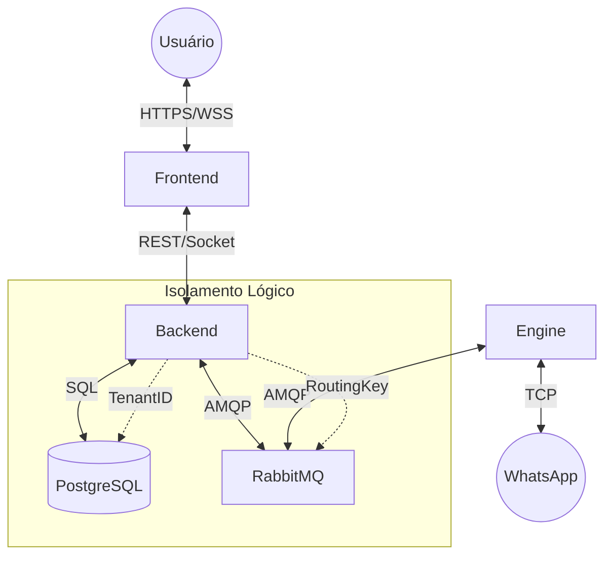

# Arquitetura de Microserviços

O Watink adota uma arquitetura distribuída, separando responsabilidades críticas em serviços independentes que se comunicam de forma assíncrona.

## Topologia

### 1. Watink Backend (Core)
- **Tecnologia**: Node.js/Express.
- **Responsabilidade**: Gestão de negócios, API REST, WebSocket para o frontend, persistência de dados.
- **Comunicação**:
  - **Entrada**: HTTP (Frontend), Socket.io (Frontend), RabbitMQ (Eventos do Engine).
  - **Saída**: Postgres (Dados), RabbitMQ (Comandos para Engine), Redis (Cache/Sessão).

### 2. Engine Standard (Worker)
- **Tecnologia**: Node.js/Baileys (Whaileys Fork).
- **Responsabilidade**: Manter conexão TCP criptografada com servidores do WhatsApp.
- **Comunicação**:
  - **Entrada**: RabbitMQ (Fila `wbot.commands`).
  - **Saída**: RabbitMQ (Exchange `wbot.events`), WhatsApp Servers (TCP).

### 3. Frontend (SPA)
- **Tecnologia**: React.js.
- **Responsabilidade**: Interface do usuário.
- **Comunicação**: Consome API REST e Socket.io do Backend.

### 4. Backing Services
- **RabbitMQ**: Message Broker. Espinha dorsal da comunicação entre Backend e Engine.
- **PostgreSQL**: Banco de dados relacional.
- **Redis**: Gerenciamento de filas e cache.
- **MinIO/S3** (Opcional): Armazenamento de mídia.

## Diagrama de Comunicação

