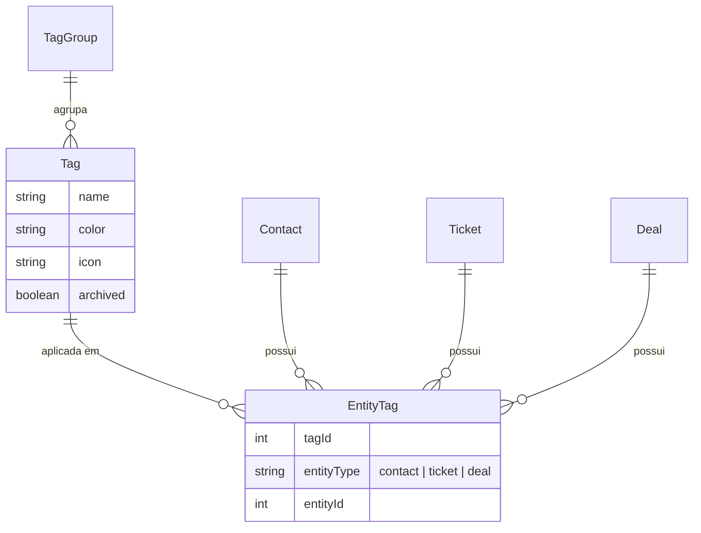

# 🏷️ Sistema de Tags Premium

O **Sistema de Tags Premium** do Watink é uma solução *enterprise-grade* para categorização, segmentação e automação de Contatos, Tickets e Oportunidades (Deals).

Diferente de etiquetas simples, este sistema trata Tags como entidades de primeira classe, com suporte a cores vibrantes, ícones, agrupamento, permissões granulares e integração profunda com o motor de automação (Flow Builder).

---

## 🚀 Funcionalidades Principais

### 1. Gestão Centralizada
*   **Tags Globais**: Crie uma tag uma vez e use em todo o sistema.
*   **Grupos de Tags**: Organize tags por contexto (Ex: *Status*, *Origem*, *Prioridade*).
*   **Identidade Visual**: Cada tag possui cores da nossa paleta premium e suporte a ícones.
*   **Contadores em Tempo Real**: Visualize quantas vezes cada tag está sendo usada.

### 2. Aplicação Universal (Polimorfismo)
Tags podem ser aplicadas a diferentes tipos de entidades:
*   👤 **Contatos**: Segmente sua base de clientes.
*   🎫 **Tickets**: Categorize atendimentos (Ex: *Suporte N1*, *Financeiro*).
*   💰 **Deals (Pipelines)**: Classifique oportunidades de vendas.

### 3. Automação Inteligente (Flow Builder)
O sistema de tags não serve apenas para visualização. Ele dispara ações:
*   **Trigger "Tag Adicionada"**: Inicie um fluxo automático assim que uma tag for aplicada a um contato/ticket.
*   **Ação "Gerenciar Tag"**: Adicione ou remova tags automaticamente dentro de um fluxo.

---

## 🎨 Paleta de Cores Premium

Utilizamos um sistema de cores harmônico para garantir legibilidade e estética profissional.

| Cor | Uso Recomendado |
| :--- | :--- |
| `red` | Erros, Bloqueios, Alta Prioridade |
| `orange`, `amber` | Atenção, Em Andamento |
| `green`, `emerald`, `teal` | Sucesso, Novos Leads, Concluído |
| `blue`, `indigo`, `sky` | Informativo, Status Neutro |
| `purple`, `violet`, `fuchsia` | Categorias Especiais, VIP |
| `gray` | Arquivados, Baixa Prioridade |

---

## 🏗️ Arquitetura de Dados

O sistema utiliza uma relação polimórfica eficiente via `EntityTags`.

---

## 🤖 Integração com Flow Builder

### Gatilhos (Triggers)
Configure fluxos que reagem a mudanças de tags:
1.  No Flow Builder, crie um novo **Gatilho Inicial**.
2.  Selecione **Tipo: Ação** -> **Tag Adicionada**.
3.  Quando a tag for aplicada (manualmente ou via API), o fluxo iniciará para o contato/ticket correspondente.

### Ações (Nodes)
Use o nó **Tag** (ícone laranja 🏷️) para manipular tags durante a conversa:
*   **Ação**: *Adicionar Tag* ou *Remover Tag*.
*   **Seleção**: Escolha a tag desejada na lista.

---

## 🔌 API Reference

### Endpoints Principais

| Método | Endpoint | Descrição |
| :--- | :--- | :--- |
| `GET` | `/tags` | Lista todas as tags (filtros: `search`, `groupId`, `includeArchived`). |
| `POST` | `/tags` | Cria uma nova tag. |
| `PUT` | `/tags/:id` | Edita uma tag existente. |
| `DELETE` | `/tags/:id` | Arquiva (soft-delete) ou remove uma tag. |
| `GET` | `/tag-groups` | Lista grupos de tags. |

### Manipulação de Entidades

| Método | Endpoint | Descrição |
| :--- | :--- | :--- |
| `POST` | `/entities/:type/:id/tags` | Aplica uma tag a uma entidade (`type`: contact, ticket, deal). |
| `DELETE` | `/entities/:type/:id/tags/:tagId` | Remove uma tag de uma entidade. |
| `POST` | `/tags/sync/:entityType/:entityId` | Sincronização em massa (substitui todas as tags). |

### Filtros de Listagem
Para filtrar contatos/tickets/deals, adicione o parâmetro `tags` na query string:
*   `GET /contacts?tags=1,2,3` (Retorna contatos que possuem *qualquer* uma das tags).

---

## 🔒 Permissões (RBAC)

O acesso ao sistema é controlado pelas seguintes permissões:

*   `tags:view`: Visualizar tags e grupos.
*   `tags:manage`: Criar, editar e arquivar tags (Admin).
*   `tags:apply`: Aplicar ou remover tags de contatos/tickets.

---

## 💡 Guia de Uso (Frontend)

1.  **Gerenciamento**: Acesse **Administração > Tags** no menu lateral para criar e organizar suas tags.
2.  **Contatos/Tickets**: No Drawer ou Modal, use o seletor de tags para categorizar.
3.  **Kanban (Deals/Tickets)**: As tags aparecem como "bolinhas" coloridas nos cards. Passe o mouse para ver o nome.
4.  **Filtros**: Use o ícone de filtro nas listagens para encontrar rapidamente itens por tag e utilize a combinação de filtros para segmentação avançada.
