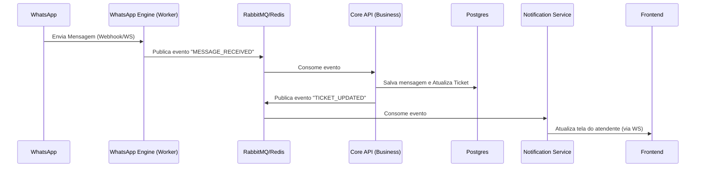

# Transformação para Microsserviços

Transformar o Whaticket (um monolito Node.js) em microsserviços é uma tarefa complexa, mas extremamente vantajosa para escalabilidade e estabilidade, especialmente considerando seu desejo de usar múltiplas bibliotecas (Baileys, Whatsmeow, etc.).

A melhor estratégia é usar o Padrão Strangler Fig (Figueira Estranguladora): você não reescreve tudo de uma vez. Você "estrangula" o monolito extraindo funcionalidades peça por peça.

Aqui está o planejamento arquitetural para essa transformação:

## 1. A Nova Arquitetura Proposta
Em vez de um único app.ts fazendo tudo, vamos dividir por Domínio de Responsabilidade.

### Os Serviços (Containers):

**API Gateway (A Porta de Entrada):**
* Recebe todas as requisições do Frontend.
* Roteia para o serviço correto.
* Lida com SSL e Rate Limiting.
* Ferramentas: Nginx, Traefik ou Kong.

**Auth Service (Identidade):**
* Responsável apenas por login, refresh token e CRUD de usuários/empresas.
* Valida quem pode acessar o quê.

**Core API (O Cérebro - Antigo Monolito "Magro"):**
* Gerencia Tickets, Contatos, Tags, Filas e Agendamentos.
* Mantém a regra de negócio do CRM.
* Importante: Ele NÃO conecta no WhatsApp. Ele apenas diz "Envie essa mensagem".

**WhatsApp Engine (O "Worker" de Conexão):**
* Aqui é onde brilha o seu projeto de "Drivers".
* Este serviço apenas mantém as sessões (Baileys/Whatsmeow) ativas.
* Ele não sabe o que é um "Ticket". Ele só sabe: "Recebi mensagem X" ou "Tenho que enviar mensagem Y".
* Pode ter várias instâncias: Um container rodando Node (Baileys) e outro rodando Go (Whatsmeow).

**Notification Service (WebSocket):**
* Gerencia o Socket.io para o frontend. O Whaticket consome muito recurso mantendo sockets abertos. Tirar isso do Core alivia a CPU.

## 2. A Camada de Comunicação (O Segredo)
Microsserviços não devem compartilhar memória. Eles conversam via rede.

* **Comunicação Síncrona (HTTP/gRPC):** Para coisas que precisam de resposta imediata.
    * Ex: O Frontend pede a lista de Tickets para o Core API.

* **Comunicação Assíncrona (Message Broker):** Para ações pesadas.
    * Ex: O WhatsApp Engine recebeu uma mensagem. Ele joga na fila message_received. O Core API pega, processa e cria o Ticket.
    * Ferramentas: RabbitMQ (Recomendado) ou manter o Redis (BullMQ) que você já usa, mas estruturado como Barramento de Eventos.

## 3. Roteiro de Migração (Passo a Passo)
Não tente fazer tudo de uma vez. Siga esta ordem:

### Fase 1: Extração do "Engine" (A mais crítica)
O maior gargalo do Whaticket é a conexão com o WhatsApp (uso de memória/CPU).
* Remova a pasta WbotServices e Libs do projeto principal.
* Crie uma nova aplicação (pode ser Node.js ou Go) que apenas inicia o Baileys/Whatsmeow.
* Use RabbitMQ/Redis para comunicação.
* Core publica na fila: `send_message_queue` -> Engine consome e envia.
* Engine recebe do WhatsApp -> publica na fila: `incoming_message_queue` -> Core consome e salva no BD.

### Fase 2: Banco de Dados Compartilhado (Fase de Transição)
No purismo de microsserviços, cada serviço tem seu banco. Na prática, migrar dados é um pesadelo.
* Inicialmente: Mantenha um único Postgres. Todos os serviços conectam nele.
* Cuidado: O WhatsApp Engine não deve escrever na tabela Tickets. Ele deve apenas ler/escrever na tabela WpSessions (se precisar). Quem grava mensagem é o Core.

### Fase 3: Gateway e Auth
Separe a autenticação. Isso permite que, se o sistema de tickets cair, o usuário ainda consiga logar (ou ver uma página de erro bonita).

## 4. Diagrama Visual do Fluxo
Imagine o fluxo de uma mensagem chegando:

## 5. Benefícios Reais para o seu Projeto iChatDev

* **Híbrido Node/Go:** Você pode ter o Core API em Node.js (aproveitando o código do Whaticket) e o Engine em Go (Whatsmeow) rodando lado a lado.
* **Resiliência:** Se uma sessão do WhatsApp travar e derrubar o container do Engine, o Core continua no ar, o atendente continua navegando nos contatos, apenas o envio/recebimento para temporariamente.
* **Escalabilidade:** Se tiver 10.000 conexões, você sobe 10 réplicas do container Engine, mas mantém apenas 1 ou 2 do Core API.
