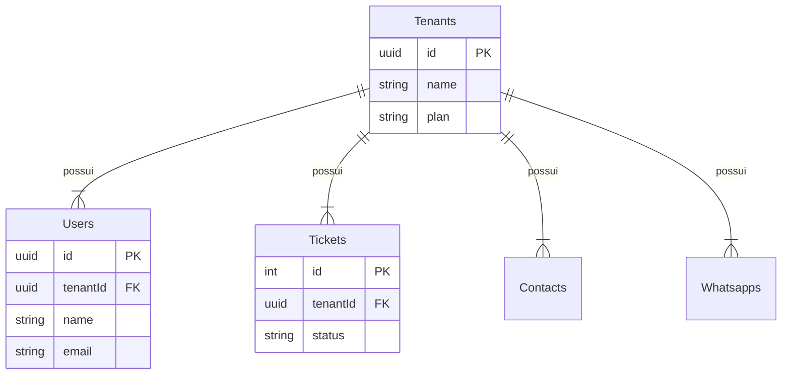

# Planejamento de Migração Multi-tenant [DB-001]

Este documento detalha a estratégia de adaptação do banco de dados do Whaticket para suportar múltiplos clientes (SaaS) com isolamento lógico.

## 1. Classificação de Tabelas

As tabelas foram analisadas e classificadas em três categorias:

### A. Tabelas de Tenant (Necessitam `tenant_id`)
Estas tabelas contêm dados que pertencem exclusivamente a um cliente. Devem receber a coluna `tenant_id` e políticas de RLS.

*   `Users` (Usuários do sistema)
*   `Contacts` (Contatos/Clientes do WhatsApp)
*   `ContactCustomFields` (Campos extras de contatos)
*   `Tickets` (Atendimentos)
*   `Messages` (Mensagens trocadas)
*   `Whatsapps` (Conexões/Sessões do WhatsApp)
*   `Queues` (Filas de atendimento)
*   `QuickAnswers` (Respostas rápidas)
*   `Settings` (Configurações do sistema - *Mudança de Global para Tenant*)
*   `Tags` (Etiquetas - *Se existir no futuro*)
*   `Schedules` (Agendamentos - *Se existir no futuro*)

### B. Tabelas Associativas (Tenant por Herança)
Tabelas de ligação N:N. Geralmente não precisam de `tenant_id` se as tabelas pai já tiverem e o RLS garantir a integridade, mas **recomenda-se adicionar** para simplificar queries e segurança.

*   `UserQueues` (User <-> Queue)
*   `WhatsappQueues` (Whatsapp <-> Queue)

### C. Tabelas Globais (SaaS Management)
Novas tabelas que devem ser criadas para gerenciar o SaaS. Não terão `tenant_id` ou terão um tratamento especial (ex: `public` schema).

*   `Tenants` (Nova: Cadastro das empresas clientes)
*   `Plans` (Nova: Planos de assinatura)
*   `Subscriptions` (Nova: Assinatura ativa do Tenant)

---

## 2. Estratégia de Migração (Schema)

### Passo 1: Criação da Tabela `Tenants`
```sql
CREATE TABLE "Tenants" (
  "id" UUID PRIMARY KEY DEFAULT uuid_generate_v4(),
  "name" VARCHAR(255) NOT NULL,
  "status" VARCHAR(50) DEFAULT 'active',
  "createdAt" TIMESTAMP WITH TIME ZONE DEFAULT NOW(),
  "updatedAt" TIMESTAMP WITH TIME ZONE DEFAULT NOW()
);
```

### Passo 2: Alteração das Tabelas Existentes
Para cada tabela listada na categoria A e B:

1.  Adicionar coluna:
    ```sql
    ALTER TABLE "Tickets" ADD COLUMN "tenantId" UUID;
    ```
2.  Criar Foreign Key:
    ```sql
    ALTER TABLE "Tickets" ADD CONSTRAINT "fk_tickets_tenant"
    FOREIGN KEY ("tenantId") REFERENCES "Tenants"("id") ON DELETE CASCADE;
    ```
3.  Criar Índice:
    ```sql
    CREATE INDEX "idx_tickets_tenant" ON "Tickets" ("tenantId");
    ```

---

## 3. Modelo de Isolamento (Row Level Security - RLS)

Utilizaremos o recurso nativo do PostgreSQL.

### Política Exemplo para `Tickets`:
```sql
-- Habilitar RLS
ALTER TABLE "Tickets" ENABLE ROW LEVEL SECURITY;

-- Criar Política de Leitura/Escrita
CREATE POLICY "tenant_isolation_policy" ON "Tickets"
USING ("tenantId" = current_setting('app.current_tenant')::uuid);
```

### Middleware no Backend
O backend deverá, antes de cada query (ou no início da transação), executar:
```sql
SET app.current_tenant = 'UUID-DO-TENANT-DO-USUARIO-LOGADO';
```

---

## 4. Diagrama ER (Conceitual)


