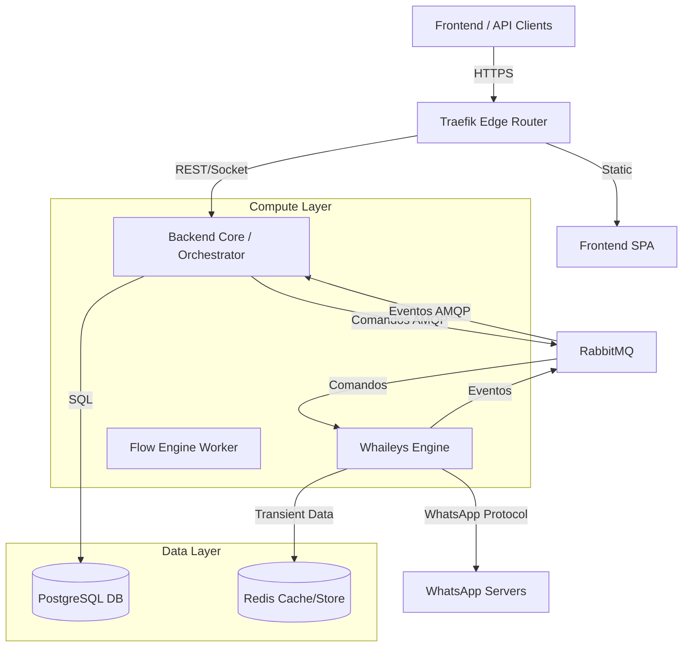

# Estratégia e Arquitetura de Microserviços (Watink)

Este documento é a referência oficial para a arquitetura de microserviços do projeto Watink. Ele define os padrões, protocolos e estratégias de escalabilidade adotados.

## 1. Visão Geral
O Watink adota uma arquitetura orientada a eventos (Event-Driven Architecture), onde serviços desacoplados se comunicam assincronamente através de um Message Broker (RabbitMQ). O objetivo é garantir alta disponibilidade, escalabilidade horizontal e tolerância a falhas.

## 2. Arquitetura de Referência

### Diagrama Lógico

### Componentes e Responsabilidades

| Serviço | Tipo | Responsabilidade | Tecnologia |
| :--- | :--- | :--- | :--- |
| **Backend** | Orchestrator | Regras de Negócio, Gestão de Dados, API REST, WebSocket Gateway. | Node.js (Express) |
| **Whaileys Engine** | Worker | Conexão com WhatsApp, Criptografia, Protocolo WA. | Node.js (Baileys) |
| **RabbitMQ** | Broker | Bus de Eventos e Comandos. | Erlang/AMQP |
| **Redis** | Store | Transient Store (Retentativas), Cache Distribuído, Lock. | Redis (Alpine) |
| **PostgreSQL** | Database | Persistência Relacional, Vetorial e Geográfica. | Postgres 15+ |

## 3. Padrões de Comunicação

### Protocolo AMQP
Utilizamos o RabbitMQ como espinha dorsal. A comunicação é dividida em dois tipos de mensagens:

#### A. Comandos (Commands)
*   **Origem**: Backend (Producer) -> Engine (Consumer)
*   **Intenção**: "Faça isso" (ex: Enviar Mensagem, Iniciar Sessão).
*   **Padrão**: Filas persistentes com *Ack* manual.
*   **Filas**: `wbot.commands`

#### B. Eventos (Events)
*   **Origem**: Engine (Producer) -> Backend/Workers (Consumers)
*   **Intenção**: "Isso aconteceu" (ex: Mensagem Recebida, QR Code Gerado).
*   **Padrão**: Pub/Sub (Exchange `wbot.events` do tipo `topic`).
*   **Roteamento**: `message.received`, `session.status`, etc.

## 4. Estratégia de Escalabilidade

### Stateless Engines
O serviço `whaileys-engine` foi desenhado para ser "quase" stateless.
*   **Sessão (Auth)**: As credenciais ficam em volume persistente (ou S3 no futuro), permitindo que qualquer container assuma a sessão se tiver acesso ao disco.
*   **Transient Data**: Dados voláteis (mensagens aguardando processamento/retentativa) são armazenados no **Redis**, não na memória RAM do processo. Isso permite que, se um container falhar, outro possa recuperar o estado ou pelo menos não perder dados críticos.

### Redis como Transient Store
O Redis atua como um buffer de alta performance e persistência leve (AOF).
*   **Função**: Armazenar mensagens recebidas e enviadas por 24h.
*   **Benefício**: Garante que o mecanismo de retentativa do Baileys funcione mesmo entre reinicializações de container.
*   **Padrão de Chave**: `wbot:msg:{jid}:{id}`

## 5. Roadmap: Transformação Microservices & SaaS

Acompanhamento das etapas de evolução da arquitetura.

### Fase 1: Arquitetura de Dados SaaS
- [x] **[DB-001] Design da Estrutura Multi-tenant**
- [x] **[DB-002] Implementação de RLS (Row Level Security)**
- [x] **[DB-003] Estratégia de Backup e Recuperação (PITR)**
- [x] **[DB-004] Preparação para Escalabilidade Horizontal (Read Replicas)**

### Fase 2: Extração do WhatsApp Engine
- [x] **[ENG-001] Configuração do Message Broker (RabbitMQ)**
- [x] **[ENG-002] Definição do Contrato de Interface (Protocolo)**
- [x] **[ENG-003] Criação do Engine "Standard" (Node.js - Baileys/Whaileys)**
- [x] **[ENG-004] Implementação do Engine "High Performance" (Go - Whatsmeow)**
- [x] **[ENG-005] Adaptação do Core (Monolito) para Consumidor Agnostico**

### Validação da Migração Whaileys & Microserviços (Dez 2025/Jan 2026)
*   **Arquitetura Atual**: Event-Driven com RabbitMQ e Redis.
*   **Status**: Redis implementado como Transient Store para garantir confiabilidade nas retentativas.

### Fase 3: Frontend & Dashboard SaaS
- [x] **[FRONT-001] Design de Wireframes e Fluxos (Admin SaaS)**
- [x] **[FRONT-002] Adaptação do Login e Autenticação**
- [x] **[FRONT-003] Desenvolvimento do Painel Super Admin**
- [x] **[FRONT-004] Dashboards Personalizáveis por Cliente**

### Fase 5: Flow Engine Scalability
- [x] **[FLOW-001] Event-Driven Architecture**
- [x] **[FLOW-002] Flow Worker Service**
- [x] **[FLOW-003] Redis Transient Store**: Implementado cache de mensagens e estrutura para store distribuído. (Jan 2026)
